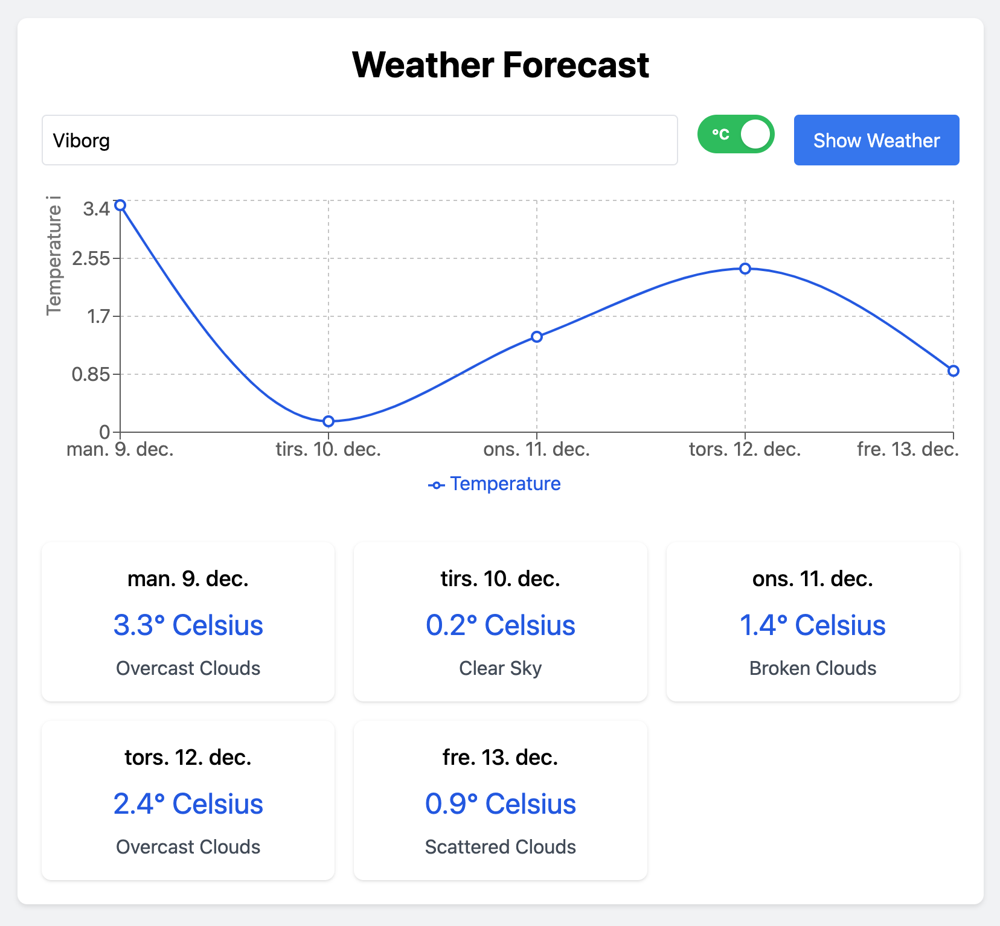

# Weather Forecast App

A modern weather forecast application built with Deno and React, featuring a 5-day weather forecast with interactive temperature charts.



## Features

- 🌍 Automatic location detection using IP geolocation
- 🌡️ Toggle between Celsius and Fahrenheit
- 📊 Interactive temperature chart using Recharts
- 🔍 Search for any city worldwide
- 📱 Responsive design with Tailwind CSS
- 🌐 Localized date formatting based on user's browser settings
- ⌨️ Keyboard support (Enter to search)

## Tech Stack

- Backend: Deno + Oak
- Frontend: React + Recharts
- Styling: TailwindCSS
- APIs: OpenWeather API, IPInfo API

## Prerequisites

- [Deno](https://deno.land/) installed on your machine
- OpenWeather API key (get one at [OpenWeather](https://openweathermap.org/api))

## Local Development

1. Clone the repository
2. Create a `.env` file in the root directory:
   ```
   OPENWEATHER_API_KEY=your_api_key_here
   ```
3. Run the development server:
   ```bash
   deno task start
   ```
4. Open http://localhost:8000

## Project Structure
```
/
├── main.ts           # Deno server
├── public/
│   ├── index.html    # HTML template
│   └── app.js        # React application
└── .env             # Environment variables (local only)
```

## Deployment on Deno Deploy

1. Go to [Deno Deploy](https://deno.com/deploy)
2. Click "New Project"
3. Choose "Deploy from GitHub" and:
   - Select your repository
   - Select the branch (usually main)
   - Set production branch to main
   - Entry point: `main.ts`

### Environment Variables
Add the following environment variable in your Deno Deploy project settings:
```
OPENWEATHER_API_KEY=your_api_key_here
```